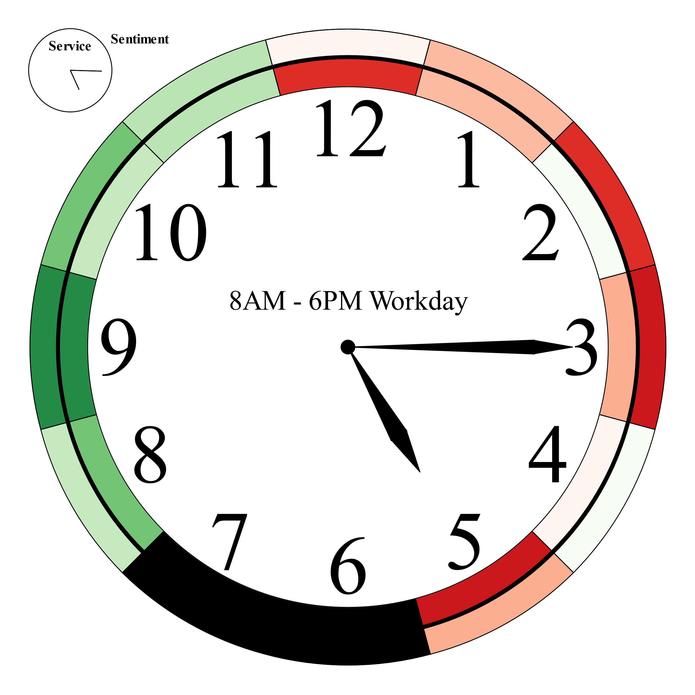

# bivariate-clock
This script allows the intake of multiple hourly metrics to compare them along a clock.  There is a step to allow the choice of two between multiple metrics.

  

# recovery-chart

This script helps visualize the strength of recovery of a risk metric (such as risk of default) over a span of time.  Tails run from the initial opening of the review period, through its "trough" - or worst performance, to its peak in recovery.  The relationship between these three points determines the length of the tails.

  

